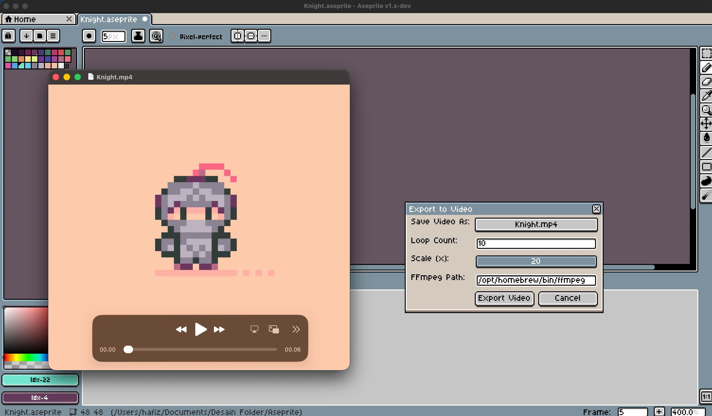

# Export Video (MP4 and MKV) in Aseprite

**Maintained Fork by HafizKurni**

This is a maintained and improved fork of [zmn-hamid's original project](https://github.com/zmn-hamid/Aseprite-Export-Video-Script) that exports Aseprite animations to MP4 and MKV using FFmpeg.

---

## ✨ What's New in This Fork

1. **One-click export, straight from your sprite**
   - No more manually exporting frames and pointing the script at the first PNG.
   - The script renders every frame of the open sprite for you, builds the video, and cleans up the temporary files automatically.

2. **Loop count baked into a single encode**
   - Set how many times the animation should play, and the loop is written directly into the export — no second pass, no separate `_loop` file.
   - Per-frame timing is preserved exactly (each frame's duration is honored, not just a fixed frame rate).

3. **Better quality than exporting through a GIF**
   - Frames are rendered to full-color PNGs before encoding, so you keep all your colors (GIF would cap you at 256).

4. **Automatic even-dimension handling**
   - Odd width/height (common with pixel art) is padded up to even numbers so `libx264` / `yuv420p` doesn't reject the export.

5. **Clear success / failure feedback**
   - On success you get a confirmation with the saved path.
   - On failure it keeps the temp frames and prints the exact FFmpeg command so you can debug or run it manually.

6. **Editable FFmpeg path in the dialog**
   - Set the FFmpeg location right in the export window — handy when moving between macOS, Windows, and Linux.

7. **File path handling**
   - Supports file names with spaces, underscores, and numbers.
   - Paths are restricted to Latin (ASCII) characters, since FFmpeg's concat demuxer can choke on non-Latin paths.

---



## 🔁 Looping

Looping is handled by the **Loop Count** field:

- `1` → the animation plays once.
- `2` → the animation plays twice (one repeat), and so on.

The loop is encoded into the single output file you chose — there is **no** separate `yourvideo_loop2.mp4` anymore.

---

## ⚙️ Prerequisites

You **must have FFmpeg installed**. The script calls FFmpeg to do the actual encoding; everything else uses Aseprite's built-in scripting API, so there are no Lua libraries or other dependencies to install.

### macOS (Homebrew)
```bash
brew install ffmpeg
```
Installs to `/opt/homebrew/bin/ffmpeg` (Apple Silicon) or `/usr/local/bin/ffmpeg` (Intel).

### Windows
Follow this guide: [How to Install FFmpeg on Windows](https://phoenixnap.com/kb/ffmpeg-windows), then point the **FFmpeg Path** field at your `ffmpeg.exe` (e.g. `C:\ffmpeg\bin\ffmpeg.exe`).

### Linux
```bash
sudo apt install ffmpeg
```
(or your distribution's equivalent)

You can confirm FFmpeg is ready by running `ffmpeg -version` in a terminal. The `libx264` encoder used by the script is included in standard FFmpeg builds.

---

## 📦 Installation

1. Download the script file.
2. Open Aseprite → **File > Scripts > Open Scripts Folder**.
3. Paste the script into the folder.
4. Restart Aseprite (or use **File > Scripts > Rescan Scripts Folder**).

---

## ▶️ Usage

1. Open and **save** your sprite (the file needs to exist on disk).
2. Run the script from **File > Scripts**.
3. In the dialog:
   - **Save Video As** — choose the output location and pick `.mp4` or `.mkv`.
   - **Loop Count** — how many times the animation plays (whole number, 1 or more).
   - **FFmpeg Path** — confirm this points at your FFmpeg install.
4. Click **Export Video**. You'll get a confirmation when it's done.

---

## 🛠️ Troubleshooting

- **"FFmpeg didn't produce a file"** — usually the FFmpeg path is wrong. Verify with `ffmpeg -version`, then correct the path in the dialog.
- **macOS Gatekeeper blocks FFmpeg** — if the export silently does nothing, run `ffmpeg -version` once in Terminal and approve it, or clear the quarantine flag:
  ```bash
  xattr -d com.apple.quarantine /opt/homebrew/bin/ffmpeg
  ```
- **Non-Latin characters in the path** — move the output to a folder whose path uses only Latin (ASCII) characters.

---

## 🎬 Demo

[Export Video Demo](https://youtu.be/8DgQN9MsYoA)
